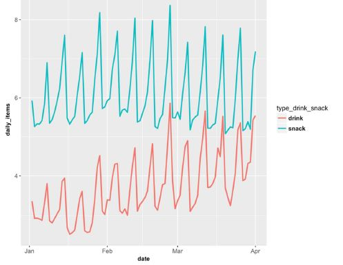
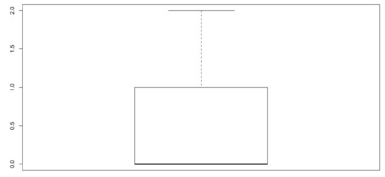

```{r setup, include=FALSE}
knitr::opts_chunk$set(echo = TRUE)
library(data.table)
library(tidyverse)
```

Reading the data
```{r}
machine_data <- fread("Data/machine_data.csv")
product_data <- fread("Data/product_data.csv")
transaction_data <- fread("Data/transactional_data.csv")

# merge data
transaction_product <- merge(transaction_data, product_data, by.x = "product_name", by.y ="product_name")
merged_data <- merge(transaction_product, machine_data, by= "machine")
```

## Question 1: General overview of the data
### Machines
```{r}
number_of_machines <- uniqueN(machine_data$machine)
machine_dist <- machine_data[,.(.N), by=small_machine]
machine_dist[,percent := round(N/number_of_machines, 4)]
machine_dist$type <- ifelse(machine_dist$small_machine == 1, 
                            yes = "small", no = "large")
```

```{r}
machine_dist %>% add_row(small_machine = NA, N = number_of_machines, percent = 1, type = "total") 
```

```{r}
machine_dist_by_location <- machine_data[,.(.N),by = .(small_machine, location_type)]
machine_dist_by_location [,percent := round(N/number_of_machines,4)]
machine_dist_by_location$type <- ifelse(machine_dist_by_location$small_machine == 1,
                            yes = "small", no = "large")
machine_dist_by_location
```
There are 2495 vending machines, wheras 38% (959) of them are small and 62% (1536) are large vending machines.
More than half of the vending machines are plased close to transportation,while only about 14% are places close to a petrol station. 

### Products 
```{r}
product_names <- unique(product_data$product_name)
number_of_products <- uniqueN(product_data$product_name)
product_dist <- product_data[,.(.N, mean_price = round(mean(price),2)), by=category][order(-N)]
product_type_dist <- product_data[,  .(.N, mean_price = round(mean(price),2)), by = .(category, type_drink_snack)][order(-mean_price)]
number_of_products; product_dist; product_type_dist
```
There are in total 63 different products, classified as drink or snack, which are distributed in 8 different categories.
Carbonates and energy drinks is the category with most products, followed by chocolate based snacks with 11 different products. 
The milk based drinks has the highest average price of 3.43, while sugar candy snack has the lowest average price.

### Transactional data
```{r}
library("openair")
transaction_data$date <- as.Date(transaction_data$date)
transactions_march <- selectByDate(transaction_data, year = 2017, month = 3)
```


```{r}
### WHY DOES WE loose one row(machine)???
transactions_march_dist <- transactions_march[, .(.N), by=.(machine, date)]

uniqueN(transactions_march_dist$machine)
uniqueN(transactions_march_dist$date)

sales_dist <- transactions_march_dist[,.(mean_sales = mean(N)), by=machine]
sales_dist <- merge(sales_dist, machine_data[,.(machine, small_machine)], by.x = "machine", by.y= "machine")
sales_dist

sales_dist2 <- sales_dist[,.(avg_sales = mean(mean_sales)), by = small_machine]
sales_dist2
plot(sales_dist)
boxplot(sales_dist$mean_sales)
```

```{r}
daily_items_sold <- transaction_data[, .(.N), by=.(machine, date)]
summary(daily_items_sold)

```

## Question 2: Plot interpretation 


a. Is there a general trend in the number of snacks and drinks as the months progress from January to April? Is it the same for snacks and drinks? Why do you think that might be so?

* drinks: an linear increasing trend (ANOVA?)
* snack: flat/no trend


```{r}
daily_items_sold <- merged_data[, .(.N), by=.(type_drink_snack, date)]
daily_items_sold <- merged_data[, .(.N), by= date]

daily_items_sold
```


b. Is there shorter time period trend as well? Is it the same for snacks and drinks? What do you think might be the cause?
* weekly seasonality (spikes on weekends?)


### Question 3: Distribution of income 

```{r}
summary(machine_data$income_average)  ### Why do we not get the same results ?? Double check 
hist(merged_data$income_average,
  xlab = "income average",
  main = "Histogram of income",
  breaks = 10)

#Removing outliers with IQR Method
Q <- quantile(merged_data$income_average, probs=c(.25, .75), na.rm = TRUE)
iqr <- IQR(merged_data$income_average, na.rm= TRUE)

up <-  Q[2]+1.5*iqr # Upper Range (beyond which datapoints are outliers)  
low<- Q[1]-1.5*iqr # Lower Range

merged_data_clean <- subset(merged_data, merged_data$income_average > (Q[1] - 1.5*iqr) & merged_data$income_average < (Q[2]+1.5*iqr))

# b)
summary(merged_data$income_average)

#Option 1: Subset complete cases only with complete.cases() or na.omit().
merged_data_cc <- merged_data[complete.cases(income_average), ] [order(date, machine)]
summary(merged_data_cc$income_average)

#Option 2: Imputation with Mean or Median.
library(Hmisc)
merged_data_mean <- impute(merged_data$income_average, mean)
summary(merged_data_mean)
merged_data_median <- impute(merged_data$income_average, median)
summary(merged_data_median)

#Option 3: Using ML algorithms like KNN.

```


### Question 4: Boxplot interpretation 

```{r}
boxplot(machine_data$num_hotels)
summary(machine_data$num_hotels)
```

```{r}
arcvi_descriptive(machine_data$income_average, machine_data$small_machine)
arcvi_descriptive(merged_data$income_average, merged_data$small_machine)
```


According to this boxplot the median number of hotels in the machine area is 0. This means that half or more of the observations is zero, this more than half of the vending machines does not have an hotel in the nearby area. The median is also in this case the same as the minimum and 1st quantile. 
The 3rd quantile is one, while the mean of the observations is 2. This is due to that most of the vending machines not have hotels nearby, while about half (4th quantile) of those who have hotels nearby seems to have many hotels, with the maximum of 79 hotels nearby.
--> if we want to use this feature later on - we should consider making a dummy of hotels nearby and not, then work on those with hotels nearby.

### Question 5: Location score
In this exercise we will build a location score that tells us what’s the average daily items per machine depending on the location it is placed. This model could be used to 
a) Decide in which locations to place new machines 
b) Construct a benchmark for each machine: how much should it sell according to its location? This can be used to detect problems in machines (i.e. illumination, bad placement within a station etc.)

```{r}
merged_data[,petrol_station:=ifelse(is.na(train_AvgDailyPassengers),1,0)]
#### we have a lot of NAs should we do something about them?


daily_items_sold <- merged_data[, .(.N), by= .(machine, date)]
daily_items_sold
merged_data_dist <- daily_items_sold[,.(daily_sales = mean(N)), by=machine]
merged_data_dist

merged_data <- merge(merged_data, merged_data_dist)
```

#### Significant variables
Do all variables show statistical significance? Which ones doesn’t? How do you know?
Hint: Recall that to check the parameters of a glm model called “model1” you need to run summary(model1)

```{r}
m0 <- glm( daily_sales ~ small_machine + income_average + total_number_of_routes_600
     + num_hotels_45 + petrol_station + num_vendex_nearby_300, 
    data = merged_data)
summary(m0)
```


#### Linear model 
Build another linear model but this time instead of using the variables
“total_number_of_routes_600 use the log of that variable in base 10 calling it
“log_transport”. Does this new variable show statistical significance?
```{r}
### SHOULD WE DO ANYTHING WITH THE NAs??
summary(merged_data$total_number_of_routes_600)
merged_data[,log_transport:= log(total_number_of_routes_600)]
colnames(merged_data)
```

```{r}
m1 <- glm(daily_sales ~ small_machine + income_average + log_transport
     + num_hotels_45 + petrol_station + num_vendex_nearby_300, 
    data = merged_data)
summary(m1)
```


#### How many daily items less do small machines sell all other factors remaining equal?
```{r}
m1$coefficients
```

#### What’s effect on machine sales does having other nearby machines all other factors remaining equal?
```{r}

```

#### Top and bottom ratio
Ranking all machines according to the final_model, what are the real daily sales of the top20% machines with respect to your model prediction? And the real daily sales of the bottom20% machines according to your model? What’s the
top20%/bottom20% ratio?


#### Choice
Given the following 2 locations for a big machine:
i. Supermarket entrance, 2 nearby hotels of 4 stars, 20 transport routes, no
nearby machines
ii. Transport station, no nearby hotels of 4 or 5 stars, 10 transport routes
nearby, 3 nearby Vendex machines
Which location would you choose and why?

